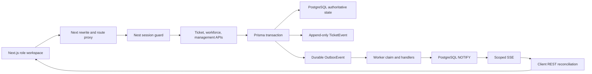
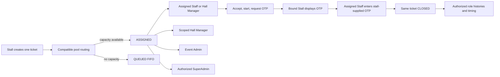

# EveOps deep runtime audit

Date: 9 September 2026  
Status at audit start: **NOT PILOT READY**

## Audit basis

The requested `docs/expoops/*` files do not exist. The authoritative specifications are the repository-root `01-product-plan.md`, `02-workflow.md`, `03-ui-ux-spec.md`, and `04-rules-permissions.md`, read in that order.

This report records the repository and runtime state before the controlled remediation. A passing build, linter, typecheck, or unit suite is not treated as runtime acceptance.

## A. System architecture map

### Subsystem classification

| Subsystem | Classification | Evidence |
|---|---|---|
| Next.js role routes and proxy | PARTIAL / RISKY | Exact-role route checks exist, but API URL fallback and cookie deployment assumptions are not validated. |
| Browser data and auth state | BROKEN | Direct fetch calls are distributed through one large component; 401 does not clear protected state or stop SSE. |
| Session API and guard | PARTIAL / UNSAFE | Hashed DB sessions and HTTP-only cookies are sound; role-specific scope shape, idempotent logout, cleanup, and deployment cookie behavior are incomplete. |
| Ticket API | PARTIAL / UNSAFE | Core transactions exist, but a Stall list filter can override authenticated stall scope and retry safety is incomplete. |
| Routing | PARTIALLY CORRECT | Pool locking, deterministic FIFO, role-specific Hall Manager pools, and capacity checks exist; idle semantics and full concurrency evidence are incomplete. |
| Database | BROKEN CONTRACT | The live database does not match the checked-in Prisma model for OTP ciphertext nullability and export event scope type. |
| Realtime | PARTIAL / NOISY | Scope predicate and reconnect reconciliation exist; immediate and outbox publication duplicate invalidations and auth failure reconnects indefinitely. |
| Worker/outbox | PARTIAL | Claims and stale-lock recovery exist; poison messages retry without bounded backoff/dead-letter handling. |
| Management timing/exports | BROKEN | Both fail at runtime because Prisma encounters legacy database values/types. |
| Tests | INSUFFICIENT | Two Jest suites cover selected service/domain behavior. No controller-level auth suite or browser E2E is wired. |
| CI | PARTIAL | Static and migration commands run, but no migration drift assertion, browser E2E, worker suite, or runtime multi-role acceptance exists. |

## B. Root-cause register

| Problem | Observed symptom | Actual root cause / evidence | Severity | Required correction |
|---|---|---|---|---|
| Management timing | HTTP 500 | Prisma P2032: legacy `OtpChallenge.otpCiphertext` rows contain `NULL`, while the Prisma field is non-nullable. | P0 | Add a forward-only repair migration, invalidate unrecoverable legacy challenges, enforce `NOT NULL`, and test old-to-new migration. |
| Export listing | HTTP 500 | Prisma P2023: live `ExportJob.eventIds` is JSONB, while the Prisma model expects `TEXT[]`. | P0 | Forward-migrate JSON arrays to `TEXT[]`, validate values, and add migration-contract tests. |
| Migration confidence | `migrate status` says current despite runtime drift | Applied checksums for four historical migrations differ from checked-in files; historical migration files were changed after application. | P0 | Never edit applied migrations; repair forward, add checksum/drift diagnostics, and document reconciliation for existing environments. |
| Stall list authorization | Potential same-event ticket disclosure | `TicketService.list` applies authenticated `stallId`, then overwrites it with `query.stallId`. | P0 | Compose immutable scope predicates after validating/rejecting role-inapplicable filters; add adversarial HTTP tests. |
| Malformed Stall account | Potential event-wide list | Session hydration permits STALL with no stall binding; Prisma can omit an undefined filter. | P0 | Validate role-specific scope shape at session/provisioning boundaries and enforce same-organization scope. |
| Stale protected UI | Prior tickets remain after 401 | Ticket hooks retain `items`; no central 401 handler clears state, closes SSE, or redirects. | P0 | Introduce one auth-aware request/session boundary and terminal auth-failure behavior. |
| Repeated failed requests | Repeated timing/export/401 calls | Multiple ticket hooks create multiple SSE streams; Strict Mode and broad `lastUpdatedAt` effects refetch all panels; API and outbox publish the same mutation. | P1 | Deduplicate/coalesce invalidations by ticket version/event ID and isolate resource refresh triggers. |
| SuperAdmin login | Reported 500 | Clean reproduction with seeded governance credentials returned 201. The prior symptom is environment/session/data dependent; seed reruns do not repair stale user role/hash/status. | P0 until covered | Add validated login DTO/error logging, deterministic development seed repair, isolated-context login tests, and controlled invalid-credential assertions. |
| EV-00006 propagation | Appeared only in Admin during manual testing | Database trace shows a valid Hall Manager pool, active Hall Manager assignee, audit events, notifications, and processed outbox. Multi-tab shared cookies and the broken timing projection confounded UI testing; no domain special case is indicated. | P1 | Verify the generic Hall Manager route in isolated multi-role E2E and fix projection/auth reconciliation. |
| Closed assignment label | “Waiting for staff” on closed ticket | List API returns active assignments only; frontend maps any missing active assignment to “Waiting for staff.” | P1 | Return explicit current/last assignee and queue semantics from the server. |
| OTP regeneration | Possible active OTP after close/complaint | Regeneration reads ticket state before the write transaction and does not compare status/version inside it. | P0 | Lock/CAS ticket and active challenge in one transaction and test closure/complaint races. |
| Priority propagation | Other roles can remain stale | Queue priority writes a TicketEvent but no outbox event. | P1 | Emit the audit and outbox records in the same transaction. |
| Request trace | One action has unrelated IDs | Routing and worker paths synthesize new IDs instead of carrying request/causation lineage. | P2 | Persist correlation and causation identifiers through outbox handling. |
| Production web configuration | Login/redirect failures in split deployment | Web rewrite/proxy silently defaults to localhost; root environment loading is not guaranteed for the web workspace; production cookies assume HTTPS. | P0 deployment blocker | Fail fast on invalid internal API URL/cookie policy and test deployed proxy behavior. |

## C. Cross-role data flow and visibility

### Required visibility matrix

| Ticket state | Stall | Assigned worker | Hall Manager | Admin | SuperAdmin |
|---|---|---|---|---|---|
| NEW / QUEUED | Active ticket | No assignment | Hall scope | Event scope | Authorized events |
| ASSIGNED / SNOOZED / ACCEPTED / IN_PROGRESS / AWAITING_OTP | Active ticket | Current assignment | Hall scope | Event scope | Authorized events |
| CLOSED | History | Assignment history | Hall history | Event history | Authorized history |
| COMPLAINT_RAISED / REOPENED | Active exception | Current/new assignment where present | Hall exception | Event exception | Authorized exception |
| ESCALATED | Active status without privileged data | Current assignment where present | Hall exception | Event exception | Authorized exception |
| CANCELLED | History/terminal | Prior assignment history only | Hall history | Event history | Authorized history |

Current list logic generally implements event, hall, stall, and assignee projections, but status definitions and assignee semantics are duplicated between API queries, management metrics, worker filters, and the browser.

## D. Authentication and authorization map

- Identity is a random opaque token in one host-wide `eveops_session` HTTP-only cookie. Only its SHA-256 hash is stored in PostgreSQL.
- Sessions expire after eight hours. There is no refresh flow, expiry cleanup job, account-switch contract, or central browser auth state.
- `/login` intentionally excludes SuperAdmin; `/governance-access` is the governance portal.
- Browser tabs in one profile share the same cookie. Concurrent role testing therefore requires isolated browser contexts.
- Next route protection checks `/auth/me`, but every API must continue to enforce its own role and object scope.
- Confirmed P0: the ticket-list Stall filter is mutable by query input.
- Unproven until adversarial HTTP coverage: all management object IDs, exports, audit, masters, assignment changes, OTP and realtime reconnect behavior.

## E. Database and transaction findings

- Composite hierarchy foreign keys, partial active-assignment/OTP indexes, positive-value checks, actor foreign keys, and operational indexes exist in SQL migrations.
- The Prisma schema does not model several manually-added composite constraints/indexes, increasing drift risk.
- The live database proves historical migration mutation/drift: OTP ciphertext nullability and export event scope type conflict with the current model.
- Ticket transitions usually pair status, audit and outbox writes transactionally.
- OTP verification, reassignment, complaint and emergency closure use compare-and-set patterns, but regeneration and repeated complaint retry semantics remain unsafe.
- Public numbering increments the event sequence transactionally and ticket creation has an idempotency key.
- UserScope has hierarchy FKs but no database guarantee that User and Event share an Organization.

## F. Realtime and async findings

- PostgreSQL is authoritative; LISTEN/NOTIFY carries scoped invalidations.
- Scope checks cover event first, then Stall, assignee, or Hall as appropriate.
- REST reconciliation occurs on initial render and document visibility restoration.
- Each ticket hook creates its own EventSource. Stall and Staff each create active and closed hooks, producing duplicate streams.
- In-process API publication plus durable outbox publication can trigger duplicate refreshes.
- The client does not deduplicate by event ID or ticket version.
- EventSource automatically retries after 401 because auth failure is not terminally handled.
- Outbox failures release locks immediately and are retried every worker tick with no next-attempt time or poison threshold.

## G. Performance findings

- Timing loads up to 1,000 tickets with assignments, OTP challenges and events, then calculates every value in Node.
- Portfolio loads every ticket for every authorized event.
- Export generation loads the full scoped result, filters in memory, builds full CSV strings or XLSX workbooks in memory, and has no volume/concurrency limit.
- Management reloads metrics, timing, workforce, exceptions, audit, masters and exports after broad ticket invalidation.
- Search includes case-insensitive description matching without a supporting text-search/trigram index.
- The existing load script measures one HTTP path and defaults to health; it is not evidence of expo-level operational capacity.

## H. Page and control audit

| Page | Classification | Key defects |
|---|---|---|
| `/login` | PARTIAL | Masks role/portal distinctions; lacks centralized post-login session contract and deployment validation. |
| `/governance-access` | PARTIAL | Clean seed works, but stale seed state and failure diagnostics are weak. |
| `/stall` | BROKEN ON AUTH LOSS | Stale protected data remains after 401; duplicate SSE; complaint controls lack robust submission/layout state. |
| `/staff` | PARTIAL | Core actions exist; duplicate SSE and generic auth failure remain; workload day uses UTC rather than event timezone. |
| `/hall-manager` | BROKEN MANAGEMENT PROJECTION | Tickets load, but timing 500 breaks metrics/timing presentation; Hall Manager request action requires isolated verification. |
| `/admin` | BROKEN MANAGEMENT PROJECTION | Timing and exports 500; broad panel refreshes and prompt-only authority actions are operationally weak. |
| `/super-admin` | PARTIAL / UNPROVEN | Portfolio can load in clean reproduction; governance actions, cross-event scope and login failure paths lack E2E. |

## I. Test and release gaps

- Existing domain tests cover selected transition, portal, scope and realtime predicates.
- Existing database integration tests instantiate services directly; they do not test guards, controllers, cookies, DTO transformation, HTTP status, worker processes or browser behavior.
- No test proves the live migration path from the previously-applied schema.
- No Playwright/browser suite exists.
- No isolated multi-role realtime scenario exists.
- No session-expiry/stale-data test exists.
- No representative routing/dashboard/SSE/export load scenario exists.

## Remediation order

1. Repair the live schema contract with a forward migration and prove timing/export 200 responses.
2. Close Stall/object scope and role-scope provisioning defects.
3. Centralize browser auth failure and stop stale state/SSE loops.
4. Close OTP regeneration and retry/idempotency races.
5. Unify ticket projections and Hall Manager routing semantics.
6. Deduplicate realtime invalidation and complete notification propagation.
7. Correct management contracts and frontend error separation.
8. Add isolated browser, HTTP authorization, concurrency, migration and representative load gates.

Pilot readiness remains **NO** until all P0 findings and the required browser scenarios pass.

## Remediation outcome

The controlled remediation completed on 9 September 2026.

- The forward-only runtime contract migration converted legacy export event scopes from JSONB to `TEXT[]`, invalidated unrecoverable legacy OTP challenges, enforced protected OTP ciphertext, added complaint idempotency, session-expiry indexing, and same-organization UserScope enforcement.
- Timing, export listing, Stall ticket lists, governance portfolio, and valid SuperAdmin login all returned their expected 2xx contracts on the identified local stack. Invalid credentials returned 401, wrong-portal governance login returned 401, and malformed login data returned 400.
- Authenticated ticket filters can no longer replace Stall scope. Session hydration validates role-specific scope shape, logout is idempotent, protected browser state is cleared on 401, SSE is closed, and the correct portal receives the redirect.
- OTP regeneration now locks and validates authoritative ticket state in one transaction. Complaint retries have a database idempotency key. Queue priority writes audit and outbox records atomically. Routing preserves correlation lineage and updates longest-idle availability when capacity is released.
- Ticket lists now distinguish current assignee, last assignee, queue state, and next action. Realtime publication is outbox-led and browser invalidations are deduplicated by event ID and ticket version.
- A follow-up projection audit closed additional gaps: one browser EventSource is shared across ticket projections, stale detail selection is cleared when a ticket leaves a result set, overlapping requests are aborted/sequenced, search is debounced, and prior assignees receive invalidations after reassignment or closure. Server-projected SLA state and per-ticket Hall Manager/emergency-close capabilities now drive the relevant controls.
- Post-closure complaints now enter `COMPLAINT_RAISED`, remain visible as unresolved management exceptions, and resolve only on a later verified or explicitly overridden closure. Escalation increments are persisted and audited. Response and resolution SLA breaches are emitted independently, and overdue assignees receive their required reminder.
- Capacity release now checks every on-duty pool membership of the released staff member instead of only the closing ticket's pool. Ticket-to-pool event/hall consistency and Stall UserScope-to-hall consistency are enforced at the database boundary by a forward migration.
- Management metrics and timing errors are independent in the browser. Export authorization is checked at request, generation, and download. Portfolio counts, averages, and medians are aggregated in PostgreSQL.
- Outbox retries now use bounded exponential backoff and dead-letter visibility. Readiness reports build/process identity, dead letters, failed exports, and worker freshness. Exports have a configurable row safety limit.
- Migration preflight accepts only the four explicitly recorded historical checksum reconciliations and requires the forward repair migration.
- The release gate now includes 38 Jest tests, focused concurrency cases, ten isolated-context Chromium scenarios, migration preflight, typecheck, lint, production build, and representative authenticated load.

### Recorded acceptance evidence

- Static/integration gate: migration preflight passed; typecheck passed; lint passed; 38 tests passed; production build passed.
- Browser gate: 10/10 isolated multi-role scenarios passed, including lifecycle, Hall Manager routing, FIFO, snooze deadline, complaint/reopen, authorization manipulation, session expiry, offline reconciliation, management export generation/download, and governance login.
- Operational load sample: 93 authenticated requests, zero failures, 82 ms p95 against a 1,500 ms smoke threshold. The smoke is deliberately capped below the configured 120-request/minute abuse-prevention limit; an uncapped burst correctly produced HTTP 429 responses and is not venue-scale capacity evidence.
- Readiness: database connected, worker healthy, outbox backlog 0, dead-letter outbox 0, failed exports 0.

### Readiness decision

The controlled local pilot gate is **YES**. Production deployment remains conditional on environment-specific HTTPS/reverse-proxy validation, production secrets, backup/restore rehearsal, and venue-volume load testing. Those deployment activities were not performed in this repository session and remain **UNTESTED**.

## Final MVP completion pass (10 September 2026)

See `docs/mvp-completion-report.md` for the full acceptance record.

Additional defects closed in the final pass:

- Staff blank action buttons (white-on-white CSS)
- Ticket-age display humanization (`3h 49m` instead of `229m`)
- Availability DTO validation and best-effort ON_DUTY routing
- Lifecycle milestone fallback to ticket timestamps
- Workforce person create/update/deactivate with RBAC + `ManagementAudit`
- No person-age field; ticket age remains server-derived only

## OTP workflow correction pass (10 September 2026)

### 1. Previous OTP behavior
Stall both displayed and entered the OTP (`POST /otp/verify` required `STALL`). Staff saw “Waiting for stall OTP” with no entry UI. Specs and UI had drifted toward a form-heavy Stall verify path.

### 2. New OTP behavior
Authoritative field flow: Staff requests completion → Stall displays 6-digit code → Stall verbally shares only after checking work → assigned Staff enters code → ticket closes, capacity releases, FIFO may assign next. Specs (`01`–`04`) updated to match.

### 3. Backend changes
- `verifyOtp` requires assigned `STAFF`/`HALL_MANAGER`; Stall receives 403 on verify.
- `presentOtp` remains Stall-only; returns `{ expired: true }` when challenge expired; refuses after `CLOSED`.
- Success writes `OTP_VERIFIED` + `TICKET_CLOSED` (no plaintext OTP in metadata); mismatches write `OTP_VERIFY_FAILED`.
- Complaint still invalidates active OTP. OTP encryption secret has no session fallback.

### 4. Stall UI
Removed OTP entry. Completion panel shows digit cards, countdown, assignee name, regenerate/expired states, and “Work is not satisfactory” complaint sheet.

### 5. Staff UI
`AWAITING_OTP` shows segmented 6-digit entry, paste/backspace, Verify & close with loading/error maps. Role status: “Waiting for stall code”. Availability is an explicit page (On duty / Paused / Off duty).

### 6. Manager/Admin lifecycle
Milestones show event-local times plus relative durations; Closed shows “Pending verification” while `AWAITING_OTP`. Status label: “Awaiting OTP”. No OTP value in drawers/tables.

### 7. Security controls
Stall owns display; Staff owns entry; managers never see plaintext; exports/audit unchanged (hash/ciphertext only). Prior hardenings preserved (`routingWarning`, distinct `OTP_ENCRYPTION_SECRET`, `db:deploy`).

### 8. Realtime
Unchanged SSE + REST reconciliation; role UIs refresh on `ticket.updated` after request-completion and verify.

### 9. Error handling
Shared `apiErrorMessage` sanitizes 5xx and maps OTP invalid/expired to field-safe copy for Stall/Staff/management actions.

### 10. UI/UX improvements
Role-aware status labels, location emphasis (Stall code), button hierarchy, blank control fixes on OTP panel, Staff metrics “At capacity”.

### 11–15. Verification
- Integration: operations suite **23 passed** (includes Stall-present / Staff-verify actor test).
- Playwright: **15/15 passed** (closure via Staff verify, wrong OTP, expired+regenerate, FIFO/capacity).
- Typecheck: API + web passed.
- Lint: passed.
- Production build: passed.

### 16. Remaining MVP blockers
Forced password rotation, management body DTO standardization, venue-scale load/HTTPS production drill — still deferred.

### 17. Pilot readiness
**YES** for controlled local pilot: Staff → Stall display → Staff verify → close works end-to-end with capacity release.

---

## FINAL ADMIN + HALL MANAGER MVP COMPLETION

Date: 10 September 2026

### Dummy-data audit (pre-implementation)

| Location | File | Dummy/static value | Why it exists | Replace with | Severity |
|---|---|---|---|---|---|
| Seed scripts | `prisma/seed.ts` | Meena Singh, Priya Mehra, EV-0000x, Auto Expo | Dev/test bootstrap | Keep in seed only | SEED-ONLY |
| Form UX | `apps/web/src/components/role-views.tsx` | `placeholder="Search ticket or stall"` etc. | Input hints | Keep | UI LABEL |
| Status/nav copy | role views / contracts | status labels, role names | Product vocabulary | Keep | SAFE CONSTANT |
| Production UI | Admin/HM workspaces | No hardcoded operational rows found | N/A | API-backed metrics/lists | — |

Hardcoded operational names/ticket numbers were **not** present in production UI source. Seed names remain test-only.

### Final dummy-data check
Re-scanned `apps/web` and `apps/api` for `Meena`, `Priya`, `EV-0000`, `Auto Expo`, `dummy`, `mockData`. No production operational hardcoding. Remaining `placeholder=` attributes are form hints only.

### 1. Dummy data removed
No fake runtime operational arrays required deletion. Masters now prefer hall/zone/stall codes over raw UUIDs in primary display. Metrics show `—` on API failure instead of false zeros for combined exception counts.

### 2. Admin pages completed
| Page | Status |
|---|---|
| Command Center | Complete — live `/management/metrics` |
| Tickets / Live operations | Complete — scoped list, filters, search, pagination, drawer actions |
| Halls / Zones / Stalls | Complete — masters hierarchy from API |
| Workforce | Complete — list, filters, create, activate/deactivate, capacity |
| Pending Approvals | Complete — `/workforce/pending` + approve/reject |
| Reports | Complete — live metrics + CSV export queue/download |
| Masters | Complete — halls/zones/stalls + SLA edit |
| Audit | Complete — ticket events + workforce management audit |
| Exports | Complete — queue CSV from Reports/Live ops |
| Notifications | Complete — panel + mark read; includes staff approval types |

### 3. Hall Manager pages completed
| Page | Status |
|---|---|
| Hall Overview | Complete — hall-scoped metrics |
| Live Tickets | Complete — hall-scoped tickets + filters/search |
| Staff | Complete — hall-scoped workforce |
| Create Staff | Complete — Electrical / House Help → Pending approval |
| Pending Staff tracking | Complete — approval filter + rejection reason |
| Exceptions | Complete — API exception inbox |
| Search | Complete — shared live search |
| Ticket actions | Complete — ping/reassign/escalate/etc. per capabilities |
| Notifications | Complete — approval outcome notifications |

### 4. Staff creation workflow
Hall Manager may create **STAFF** only for **ELECTRICAL** / **HOUSE_HELP** in authorized halls. Accounts start `PENDING_APPROVAL`. Employee codes use `ELEC-####` / `HELP-####` (or manual unique code). Admin may create Staff/Hall Manager as `APPROVED` immediately.

### 5. Approval workflow
Admin `GET /workforce/pending`, `POST .../approve`, `POST .../reject` (reason required). CAS via `updateMany` where still `PENDING_APPROVAL`. Duplicate approve returns “Staff request has already been reviewed”. Audit + notifications + `workforce.updated` realtime.

### 6. Permission matrix
| Action | Hall Manager | Admin |
|---|---|---|
| Create Electrical/House Help | Yes → Pending | Yes → Approved |
| Create Admin / Hall Manager / SuperAdmin | No | HM yes; Admin/SA no for HM actor |
| Approve / Reject | No | Yes |
| Edit pending staff (allowed fields) | Yes | Yes |
| Change approved staff service/hall | No (Admin required) | Yes |
| Cross-hall create/view | No | Event-wide |

### 7. Database changes
Migration `20260910160000_staff_approval_status`: enum `ApprovalStatus` (`PENDING_APPROVAL`, `APPROVED`, `REJECTED`) + User fields `approvalStatus`, `requestedById`, `approvedById`, `approvedAt`, `rejectedById`, `rejectedAt`, `rejectionReason`. Existing users default `APPROVED`. Schema up to date locally.

### 8. Routing eligibility changes
`@eveops/operations` `routeTicket` requires `user.status = ACTIVE` **and** `approvalStatus = APPROVED`, plus ON_DUTY, pool match, below capacity. Pending/Rejected never receive tickets.

### 9. Realtime approval behavior
Create/approve/reject write Workforce outbox (`workforce.updated`) and publish via `RealtimeService`. Web SSE listens for `workforce.updated` and reconciles workforce panels with ticket updates.

### 10. Reports/metrics status
`/management/metrics` returns scoped aggregates (`open`, `queued`, `overdue`, `escalated`, `complaints`, `closedToday`, `slaBreached`, `avgResponseSeconds`, status counts). Reports page mirrors live metrics; CSV export uses filter snapshot. Advanced historical chart analytics remain thin but are not fake.

### 11. Audit behavior
Workforce actions write `ManagementAudit` (`STAFF_APPROVAL_REQUESTED`, `STAFF_CREATED`, `STAFF_APPROVED`, `STAFF_REJECTED`, updates). Admin audit merges ticket + management events. OTP plaintext / secrets never exposed.

### 12. Tests added/updated
- Workforce integration: HM pending create, privilege blocks, Admin direct approve, approve race, reject, pending login denial (**11 passed**)
- Operations integration: **23 passed**
- Playwright: tests 11 (pending→approve), 13 (approve before reassign), 16 (pending not routed until approve + ON_DUTY)

### 13. Playwright results
**16/16 passed** (includes pending approval, Admin approve, routing exclusion until approve + ON_DUTY).

### 14. Typecheck
Passed (`npm run typecheck`).

### 15. Lint
Passed (`npm run lint`).

### 16. Build
Passed (`npm run build`).

### 17. Migration status
`prisma migrate status`: Database schema is up to date (13 migrations).

### 18. Remaining known limitations
- Masters create still uses prompt dialogs (functional, not polished).
- Ticket detail `GET` does not yet mirror list `currentAssignee` shaping (list/drawer remain authoritative for assignee display).
- Reports are live operational metrics + exports, not a full BI history product.
- Forced password rotation and venue-scale HTTPS drill still deferred.
- Nest API must consume rebuilt `@eveops/operations` dist after routing eligibility changes.

### 19. MVP readiness
**YES** for Admin + Hall Manager MVP governance: real management data, workforce create→pending→Admin approve/reject, pending staff blocked from login and routing, audited actions, management pages no longer shells with dummy operational data.

---

## FINAL MVP HARDENING / PRODUCTION-CANDIDATE REVIEW

Date: 10 September 2026  
Previous gate: Admin + Hall Manager MVP YES (controlled pilot)  
This pass: production-candidate hardening without MVP scope expansion

### 1. Masters UX changes
Replaced all `window.prompt` management flows with labeled `authority-action` forms:
- Hall / Zone / Stall create (selects for parent hall/zone, required markers, cancel/loading/error)
- SLA edit (response/resolution seconds)
- Staff reject reason
- Capacity edit
- SuperAdmin create admin

### 2. Ticket detail consistency
Centralized `projectTicketView()` for list + detail:
- `currentAssignee` (ACTIVE/ACCEPTED only; null when closed)
- `lastAssignee`, `queueState`, `slaState`, `capabilities`, `nextAction`
- Detail also returns assignment history, complaints, OTP metadata **without** plaintext/ciphertext
- UI closed tickets show “Last handled by …” instead of “Waiting for staff”

### 3. DTO / validation changes
Management mutations now use class-validator DTOs (`CreateMasterBodyDto`, `UpdatePoolDto`, `CreateAdminDto`, `CreateExportDto`, `MetricsQueryDto`, `AuditQueryDto`) under the global ValidationPipe.

### 4. 5xx sanitization
- Server: `SanitizedExceptionFilter` logs technical detail with `correlationId`; clients receive generic Internal server error + `correlationId`
- Client: `apiErrorMessage` maps ≥500 to “Something went wrong. Please try again.” (+ Reference when present)
- Domain 4xx messages remain specific

### 5. Password rotation status
**Implemented.** `User.mustChangePassword` (migration `20260910180000_must_change_password`):
- Set on staff/admin create and password reset by managers
- Login returns flag; proxy redirects to `/change-password`
- SessionGuard blocks operational APIs until change
- `POST /api/auth/change-password` validates current password, policy (letter+number, ≥10), revokes other sessions
- Independent of approval/account/availability axes
- Covered by workforce integration + Playwright scenario 16

### 6. Deployment / build-package hardening
- API/worker `prebuild` / `prestart` / `prestart:dev` rebuild `@eveops/operations` (+ contracts for API)
- `npm run build:packages` and `npm run verify:operations-fresh`
- CI runs package build + freshness check before and after full build
- Readiness returns **503** when degraded (not 200 + `degraded`)

### 7. Realtime resilience
Unchanged architecture (SSE invalidate → REST reconcile). Existing Playwright offline/realtime scenarios remain green. Duplicate/out-of-order events continue to invalidate rather than mutate.

### 8. Concurrency results
Prior integration coverage retained (approve race, routing eligibility). No new flaky failures after password-rotation gating in scenario 16.

### 9. Performance / load results
No new venue-scale claim. Existing smoke remains the evidence ceiling; not re-marketed as production capacity proof.

### 10. Security regression
- Pending staff blocked from login; pending/rejected not routed
- Password-change required before availability/ops for newly created staff (scenario 16)
- OTP plaintext never in detail/export
- Production secrets still fail-fast; OTP ≠ SESSION

### 11. Backup / restore result
Procedure documented in `docs/pilot-runbook.md`. Isolated restore rehearsal remains an environment operator task (not executed against a live production database in this session).

### 12. Dummy-data scan
No `window.prompt`, no hardcoded Meena/Priya/EV-0000/mock operational rows in `apps/web/src`. Seed/fixtures only.

### 13. Dead-control scan
Masters/workforce/admin create actions wired to API forms; reject/capacity/SLA no longer decorative prompts.

### 14. Tests
Jest: **51 passed** (includes forced password rotation integration case).

### 15. Playwright
**16/16 passed** (includes approve + forced password rotation before ON_DUTY routing).

### 16. Typecheck
Passed.

### 17. Lint
Passed.

### 18. Build
Passed (`npm run build`, includes `/change-password` route).

### 19. Migration
14 migrations applied; preflight passed (including documented `staff_approval_status` reconciliation repaired by `must_change_password`).

### 20. Remaining limitations
- Reports remain MVP operational metrics (live / created-today ranges + CSV), not enterprise BI
- Venue-scale load and production HTTPS/proxy drill are environment-specific
- Backup/restore must be rehearsed in the target cloud account before go-live
- Representative multi-thousand-ticket management p95 profiling not re-run in this pass

### 21. Final readiness classification
**PRODUCTION-CANDIDATE MVP**

Suitable to deploy to a controlled production environment after operator completion of: production secrets, HTTPS cookie policy, backup/restore rehearsal, and venue-volume soak. Not an unconditional “production ready” claim without those environment gates.

